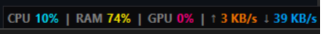

# WinMonitor

A lightweight, elegant, and non-intrusive hardware system monitor for Windows. It runs as a thin status bar that floats on or right above the taskbar in the bottom-right corner of the screen.



## Features
- **Real-Time Data**: Dynamic text display showing CPU%, RAM%, GPU% (if available), network speeds (Upload/Download), and per-drive disk performance active times.
- **Disk Performance**: Real-time read (↑) and write (↓) performance percentages for each physical drive (e.g. `C: ↑ 0% ↓ 5%`) utilizing Windows performance counters.
- **Customizable Module Visibility**: Choose what information you want to see. Toggle individual modules (CPU, RAM, Disk, GPU, Network) on/off directly from the right-click menu or system tray menu.
- **Configuration Persistence**: Your customized visibility settings are automatically saved locally to `winmonitor_config.json` and persist across application runs.
- **Temperatures**: Displays CPU package and GPU core temperatures (via LibreHardwareMonitor).
- **Draggable**: Drag with your left mouse button to position it anywhere on your screen.
- **Auto-Sizing**: Automatically shrinks or grows to fit the active text perfectly.
- **Fixed Right Anchor**: Auto-resizes from the left side, keeping the right edge fixed exactly where you position it.
- **Auto-Run**: Toggle "Start with Windows" directly from the right-click menu or the system tray icon to enable/disable starting on boot.
- **Lightweight**: Minimal CPU and RAM footprint.

## Requirements
Ensure you have Python 3.10+ installed.

### Core Dependencies (Required)
Required for basic system monitoring (CPU, RAM, Disks, Network):
```bash
pip install psutil pillow pystray
```

### Optional Dependencies
Only required for specific tracking features:
- **`pynvml`** (For NVIDIA GPU utilization tracking)
- **`wmi`** (For CPU/GPU temperature tracking via LibreHardwareMonitor)

To install all dependencies (core + optional):
```bash
pip install psutil pillow pystray pynvml wmi
```
*(If optional packages are missing or hardware is unsupported, WinMonitor will automatically and gracefully hide those modules while remaining fully functional).*

## Running the Application
You can run WinMonitor in two ways:

### 1. Pre-compiled Executable (Easiest)
Download [dist/WinMonitor.exe](dist/WinMonitor.exe) directly from this repository and run it. No Python installation required.

### 2. Python Script
Run directly using Python:
```bash
python WinMonitor.py
```

## Compiling to Executable (.exe)
You can bundle the script into a standalone Windows executable using PyInstaller:

1. Install PyInstaller:
   ```bash
   pip install pyinstaller
   ```
2. Build the executable:
   ```bash
   pyinstaller --onefile --noconsole --name=WinMonitor WinMonitor.py
   ```
3. The compiled `WinMonitor.exe` will be located inside the `dist/` directory.

## Adding to Windows Startup

WinMonitor provides three ways to start automatically when you log into Windows:

### Method 1: Built-in Toggle (Recommended & Easiest)
1. Run `WinMonitor` (either the compiled `WinMonitor.exe` or via the Python script).
2. **Right-click** either the floating bar or the system tray icon (near the clock).
3. Select **"Start with Windows"** to enable it. This automatically registers the application in the Windows Registry.

### Method 2: Windows Startup Folder (Manual Shortcut)
If you do not want to use the registry or prefer a standard shortcut:
1. Press `Win + R` to open the **Run** dialog.
2. Type `shell:startup` and press **Enter** to open the Startup folder.
3. Right-click inside the folder, choose **New > Shortcut**.
4. Browse to your compiled `WinMonitor.exe`, select it, and click **Finish**.

### Method 3: Manual Registry Entry
If you want to manually configure the registry:
1. Press `Win + R`, type `regedit`, and press **Enter** to open the Registry Editor.
2. Navigate to the following path:
   ```text
   HKEY_CURRENT_USER\Software\Microsoft\Windows\CurrentVersion\Run
   ```
3. Right-click the right pane, select **New > String Value**, and name it `WinMonitor`.
4. Double-click the `WinMonitor` string and set its value to the absolute path of your executable (e.g., `C:\Users\YourUsername\Paths\WinMonitor.exe`).

## License
MIT License

